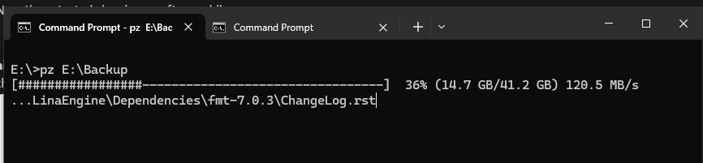

# Project Zipper



`pz` is a lightweight Go CLI that creates and extracts zip and gzip archives using only the Go standard library. It features automatic multi-threading (using 50% of available CPU cores) for improved performance and generates unique archive names by appending version suffixes when an archive with the base name already exists.

## Features

- **Smart Auto-Compression** - Automatically optimizes compression level based on file size and type
  - Small archives (<10MB): Maximum compression for best results
  - Medium archives (10-100MB): Balanced compression
  - Large archives (100-500MB): Speed-favored compression
  - Very large archives (>500MB): Maximum speed
  - Already-compressed files (JPG, PNG, MP4, ZIP, etc.): Stored without recompression for efficiency
- **Automatic Checksum** - SHA-256 hash calculated and stored for every archive
  - ZIP archives: Checksum stored in archive comment
  - tar.gz archives: Checksum stored in `.sha256` sidecar file
  - Displayed after compression completes
- **Multi-threaded compression/extraction** - Automatically uses 50% of available CPU cores for parallel processing
- **Multiple formats** - Supports both ZIP and tar.gz formats
- **Smart naming** - Auto-versioning (e.g., `project.zip`, `project-v1.zip`, `project-v2.zip`)
- **Progress tracking** - Real-time progress bars with speed indicators
- **Cross-platform** - Works on Windows, Linux, and macOS
- **Security** - Built-in path traversal protection

## Prerequisites

- Go 1.21 or later

## Install

```powershell
# From the project root
go install ./cmd/pzip
```

This installs the `pzip` binary into your `$GOBIN` (or `$GOPATH/bin`).

## Usage

### Create Archive

**Create ZIP archive (default):**
```powershell
pz <path-to-folder>
```

**Create tar.gz archive:**
```powershell
pz -f gz <path-to-folder>
```

- Archives the specified folder into `<folder>.zip` or `<folder>.tar.gz` alongside the source folder.
- If `<folder>.zip` (or `.tar.gz`) already exists, a versioned archive such as `<folder>-v1.zip`, `<folder>-v2.zip`, etc. is created instead.
- Paths containing spaces are supported without quoting (e.g. `pz C:\Active Projects`).

### Extract Archive

```powershell
# Extract to current directory
pz -x <archive.zip>
pz -x <archive.tar.gz>

# Extract to specific destination
pz -x <archive.zip> <destination-folder>
pz -x <archive.tar.gz> <destination-folder>
```

- Extracts the contents of a zip or tar.gz archive
- Automatically detects archive format based on file extension
- Creates destination directory if it doesn't exist
- Shows progress bar with extraction speed
- Includes path traversal protection for security

### Windows Context Menu Integration

Add "Compress with pz" to Windows Explorer right-click menu:

```powershell
# Install context menu (requires administrator)
pz --context install

# Check installation status
pz --context status

# Uninstall context menu
pz --context uninstall
```

Once installed, you can right-click any folder or file and choose:
- **Compress to ZIP** - Creates a .zip archive
- **Compress to tar.gz** - Creates a .tar.gz archive
- **Extract here** - Extracts archives to the current location

The tool automatically requests administrator privileges if needed.

### Progress Output

**Creating Archive:**
```text
Creating archive for H:\Example\Project (6.1 MB) using 18/36 CPUs...
[##############################--------------------] 62% (3.8 MB/6.1 MB) 4.2 MB/s
✓ Archive complete: H:\Example\Project -> H:\Example\Project.zip (6.1 MB source, 2.9 MB archive, 12 files)
```

**Extracting Archive:**
```text
Extracting Project.zip (2.9 MB) using 18/36 CPUs...
[##################################################] 100% (6.1 MB/6.1 MB) 8.3 MB/s
✓ Extraction complete: Project.zip -> H:\Example\Extracted (6.1 MB extracted, 12 files)
```

The tool automatically detects your CPU count and uses 50% of available cores for parallel file processing, significantly improving performance on multi-core systems.

## Windows Env

To add the tool to the system `env` you can copy the pz.exe from `bin\pz.exe` to `C:\Program files\pz\pz.exe`.
Then `start` type `env` click `Enviroment Variables` select `Path > Edit > New`.
Then paste `C:\Program files\pz\`.

Open `cmd / powershell` type `pz` and you should get the usage information.

**Recommended:** After adding to PATH, run `pz --context install` to enable right-click context menu integration.

## Development

```powershell
# Format code
gofmt -w .

# Build and verify
go build ./...

# Run tests
go test ./...
```

`pzip` Can be renamed to `pz` when you run `go build -o pz.exe`

## Continuous Integration

This repository includes a GitHub Actions workflow (`.github/workflows/ci.yml`) that checks formatting and runs the test suite on each push and pull request.

## License

MIT License. See [`LICENSE`](LICENSE) for details.
